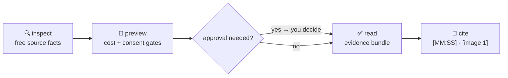

<div align="center">


# Voidscape

**Turn the media you keep into evidence an agent can cite — locally, visibly, and on your terms.**

[](LICENSE)
[](#requirements)
[](#requirements)
[](#the-contract)
[](https://github.com/RikepilB/void-scape/actions/workflows/tests.yml)

[Website](https://voidscape.club) ·
[Guide](https://voidscape.club/guide.html) ·
[Agent documentation](docs/agents/index.md) ·
[Issue Tracker](https://github.com/RikepilB/void-scape/issues)

</div>

---

## The problem

An agent cannot watch your video. Hand it `meeting.mp4` and it has a filename, maybe a title, and a
guess — so it writes a plausible summary and you cannot tell which sentence came from the recording.

Voidscape turns that file into three things an agent can actually inspect.

| | Without Voidscape | With Voidscape |
| --- | --- | --- |
| What the agent sees | A filename and a title | Ordered frames, timestamped text, a manifest |
| What a claim rests on | The model's prior | `[00:04]` in `transcript.txt`, `[image 1]` in `images/` |
| What it costs | Unknown until the bill arrives | `preview` prices the job before `read` runs it |
| What leaves your machine | Whatever the tool decided | Nothing, until you approve that specific run |

No account. No API key. No uploads by default. Just your machine, your media, and receipts.

> 🎬 **Watch it work** — a 52-second terminal recording of the real flow:
> [`doctor` → `inspect` → `preview` → `read` on the key-free demo fixture](docs/assets/cli-demo.mp4)
> (recorded live, no account, no API key, no edits).

## Quick start

You do not need to clone this repository. Install the CLI once, let it add the bundled agent skill,
then use `voidscape` from any terminal.

### 1 · Install `uv`

```powershell
# Windows PowerShell
winget install --id=astral-sh.uv -e
```

```bash
# macOS / Linux
curl -LsSf https://astral.sh/uv/install.sh | sh
```

Already have `uv --version` working? Skip to step 2.

### 2 · Install Voidscape and its agent skill

```powershell
uv tool install https://github.com/RikepilB/void-scape/archive/refs/heads/main.zip
uv tool update-shell
voidscape init
```

`uv tool install` creates the global `voidscape` command and installs `yt-dlp` in its isolated
environment. `voidscape init` copies the bundled skill to `~/.codex/skills/voidscape` and
`~/.agents/skills/voidscape`, then checks your local media tools. It approves nothing: no cloud job,
no model download.

Command not found yet? Open one new terminal and run `voidscape init` there. CLI only?
Use `voidscape init --no-skill`. Updating later? Add `--upgrade` to the install command, then
re-run `voidscape init`.

### 3 · Prove the flow

```powershell
voidscape doctor
voidscape inspect "meeting.mp4"
voidscape preview "meeting.mp4"
voidscape read "meeting.mp4" --workdir voidscape-output
```

`doctor` reports what is ready and changes nothing. If it flags FFmpeg, install it:
`winget install --id=Gyan.FFmpeg -e` (Windows), `brew install ffmpeg` (macOS), or
`sudo apt update && sudo apt install ffmpeg` (Debian/Ubuntu).

## The three commands

The order is the product. Each step tells you what the next one will do before it does it.



| Step | Command | What you learn or get |
| --- | --- | --- |
| **Inspect** | `voidscape inspect <input>` | Duration, resolution, audio, captions, sidecars — free, changes nothing. |
| **Preview** | `voidscape preview <input>` | Transcription path, frame plan, token cost, dependency and approval state. |
| **Read** | `voidscape read <input>` | Only the approved artifacts: selected frames, transcript, and a manifest. |

The same three commands handle local video and audio, individual public video URLs, one image or a
filename-ordered folder, articles, RSS/Atom feeds, and chat exports. A matching `.srt`, `.vtt`, or
`.txt` beside your file is reused as a free local sidecar instead of being transcribed again.

## What `read` hands back

```text
voidscape-output/
├── frames/           selected keyframes from the source timeline
├── transcript.txt    timestamped speech-to-text (when audio was approved)
└── manifest.json     the map: frames ↔ timestamps ↔ source facts
```

Hand that folder to any agent with one prompt:

> Open `voidscape-output/manifest.json` and `transcript.txt`, then inspect `frames/`.
> Summarize the recording in three bullets. Support every factual claim with an exact `[MM:SS]`
> citation. If the evidence is insufficient, say so.

That last sentence is the product. An agent grounded in the manifest cites moments; an agent
guessing from a filename invents them.

<details>
<summary><b>Pick the right command for your source</b></summary>

| You have… | You want… | Do this |
| --- | --- | --- |
| A recording, demo, meeting, or screen capture | Cited, timestamped evidence | `inspect → preview → read` |
| One image or a carousel folder | Ordered visual evidence, originals untouched | `inspect → preview → read` |
| A voice memo or call | A local transcript to reason from | `read ... --tier audio` |
| A supported public video URL | The useful part, kept locally | `inspect → preview → read` |
| A Substack article or RSS/Atom feed | Ordered text with source metadata | `inspect → preview → read` |
| A chat export (`_chat.txt`) | Searchable, citable conversation | `inspect → preview → read` |
| Reddit, LinkedIn, X, TikTok, or another web source | To know what is possible first | `voidscape route <url>` |
| An agent, hook, or script driving it | Deterministic, machine-readable output | `voidscape ... --json` |

`route` answers "will this even work?" before you spend anything:

```console
$ voidscape route "https://www.reddit.com/r/example/comments/abc/def/"
Voidscape source route
  Platform: reddit
  Reader: article
  Alternatives: article, video
  Capture: not_shipped
  Note: Reddit posts are mixed media; use --reader video when the selected post is media-first.
```

Use `--reader video|article|image` only when an ambiguous source needs an explicit override.
Run `voidscape sources --json` for the full machine-readable platform matrix.
</details>

<details>
<summary><b>Images and carousels</b></summary>

An image read prepares byte-preserving `images/` plus `manifest.json`. The folder scan is
**non-recursive**, follows natural filename order (`slide1.png` before `slide10.png`), and is capped
at **100 images** per read. Cite carousel evidence as `[image 1]` — never as a fabricated timestamp.

```powershell
voidscape inspect "slides"
voidscape preview "slides"
voidscape read "slides" --workdir slide-evidence
```
</details>

<details>
<summary><b>Optional: choose where your media and notes live</b></summary>

```powershell
# Preview Inbox, Library, and local transcription defaults.
voidscape customize

# Save only after reviewing the preview.
voidscape customize --yes --create-dirs
```

`customize` stores local paths and defaults in `~/.voidscape/workspace.json`. It never stores API
keys, and model downloads plus every cloud transcription job remain separate, per-run approvals.
</details>

## Use it with an agent

After install, run `/voidscape <file-or-url>` in any harness that exposes skills as slash commands —
or just ask your agent to inspect, preview, and read your media with Voidscape. The installed skill
teaches it the same flow:

1. inspect the source;
2. preview the selected scope;
3. **stop for explicit consent** when cloud processing or a model download is required;
4. read the artifacts and answer with `[MM:SS]` or `[image 1]` citations.

<details>
<summary><b>Browser, phone, and harness boundaries</b></summary>

Browser and phone control belong to the agent harness, not the media engine. With an approved Chrome
connection, your agent can select permitted media in signed-in tabs, then run Voidscape on the host
machine that can reach the files; remote-control sessions can continue that host task from a phone.
Browser access does not authenticate `yt-dlp` — see
[multi-harness, browser, and remote support](docs/harness-support.md).

Harness connectors — a messaging MCP the harness already trusts, an approved browser tab, or the
repository capture adapters — only deliver local files or public URLs into the same
`inspect → preview → read` gates. The [connectors contract](docs/agents/connectors.md) keeps it that
way; shipping an MCP server from Voidscape itself remains a documented no-go.

Two pieces ship with that story:

- **Chat exports** — a WhatsApp-style `_chat.txt` reads natively as ordered `[message N]` evidence,
  fully local, referenced media included.
- **[Harness skill kit](docs/agents/harness-kit.md)** — copy-and-adapt templates (inbox triage,
  evidence-grounded outreach, learning capture, catch-up) that ride on Voidscape citations.

For the deep patterns — collection runs, formatted deliverables (Markdown/HTML/xlsx/docx/pdf), and
grounded executive-scribe summaries — read [workflow and protocol](docs/agents/workflow.md) and
[agent automation](docs/agents/automation.md).
</details>

## Common questions

<details>
<summary><b>Does Voidscape upload my media?</b></summary>

Not by default. Local files, sidecar subtitles, and local transcription stay on your machine. Any
cloud transcription path is blocked until you explicitly add `--allow-cloud`, and a first-time local
Whisper model download separately needs `--allow-model-download`. An API key sitting in your
environment is not consent.
</details>

<details>
<summary><b>What does it cost?</b></summary>

`preview` estimates transcription and API-equivalent agent-token cost before `read` runs, including
the dominant cost driver, backend chain, local dependency, and approval state. If your agent runs on
a subscription rather than per-token billing, treat the reported amount as an honest comparison
estimate, not an invoice.
</details>

<details>
<summary><b>What is the difference between <code>read</code> and <code>read-video</code>?</b></summary>

Voidscape is the guided name and product experience. `read-video` is the underlying, stable CLI and
legacy installed skill. Existing scripts keep using raw `video.py`; new users should start with
Voidscape.
</details>

<details>
<summary><b>Can I automate it?</b></summary>

Yes — the CLI is non-interactive when given explicit flags, so scripts, hooks, and agent runners can
call it. Voidscape ships no scheduler and no unattended worker, so your automation stays responsible
for preserving the cloud and model-download approval gates.
</details>

<details>
<summary><b>A URL works in Chrome but fails in the CLI. Why?</b></summary>

Your browser is signed in; the CLI is anonymous. Start with a public URL. For media your account is
permitted to access, export cookies for only that site, keep the file outside the repo, and set
`READ_VIDEO_YTDLP_COOKIES`. VPNs, expired sessions, platform extractor changes, and missing Chrome
site approval are separate common causes — see the
[authentication and troubleshooting guide](docs/authenticated-sources.md).
</details>

<details>
<summary><b>What happens when a read fails halfway?</b></summary>

Usable artifacts remain, explicitly marked as partial evidence — missing audio is never reported as
a successful full read. Structured failures tell your agent whether it needs your approval, a model
download, or a missing environment variable. Long reads also leave a private recovery pointer at
`<workdir>/.agent/latest-read.json`, so a truncated terminal does not mean reprocessing the source.
See the [recovery contract](docs/cli-reference.md).
</details>

## Requirements

- Python 3.10+
- `ffmpeg` and `ffprobe` on `PATH`
- `yt-dlp` only for URLs
- `faster-whisper` only for local speech transcription

Run `voidscape doctor` to see what is ready — it changes nothing.

## The contract

- **Local-first.** Nothing leaves your machine without a per-run, explicit approval.
- **Readable boundary.** Cloud transfer and model downloads are separate, visible gates.
- **Citable output.** Every artifact maps back to the source timeline; agents quote moments, not vibes.
- **No hidden automation.** Installing Voidscape creates no scheduled job, no account permission, and
  no subscription-as-API-credit trap.
- **Reading, not acting.** Permission to read never implies following, messaging, or publishing.

## Advanced

<details>
<summary><b>Raw engine interface (scripts, subagents, integrations)</b></summary>

The underlying engine is stable and separately callable:

```powershell
python skill/scripts/video.py manifest --compact
python skill/scripts/video.py probe "clip.mp4" --envelope --compact
python skill/scripts/video.py estimate "clip.mp4" --tier both --backend captions --envelope --compact
python skill/scripts/video.py run "clip.mp4" --tier both --backend captions --workdir out --envelope --compact

python skill/scripts/image.py manifest --compact
python skill/scripts/image.py probe "slides" --envelope --compact
python skill/scripts/image.py estimate "slides" --envelope --compact
python skill/scripts/image.py run "slides" --workdir slide-evidence --envelope --compact
```

Every envelope is `{ok,data,error,meta}` with deterministic exit codes 0–6 and retryability
metadata. Windows CLI output uses UTF-8, so international titles and filenames survive.
</details>

<details>
<summary><b>Staged reads, alignment, word timings, and batches</b></summary>

- **Stop mid-flow.** Match `--stop-at probe|frames` in preview and read to review frames before
  choosing transcription. Stopped manifests and recovery pointers distinguish a deliberate stop from
  a complete read; the later transcription still needs its own matching preview and consent.
  See [stage stopping](docs/cli-reference.md#deliberately-stop-a-video-read).
- **Reference alignment.** Optionally compare a transcript against a local script or caption file.
  It preserves the original transcript and start timestamps, records per-segment provenance, and
  leaves low-similarity segments unchanged with warnings — similarity is not a claim of correctness.
  See [reference alignment](docs/cli-reference.md#align-transcript-text-against-a-reference).
- **Local Whisper controls.** Opt-in [word timing and vocabulary hints](docs/cli-reference.md#local-whisper-controls)
  preserve model-estimated starts/ends and clipping offsets. Explicit controls keep the
  model-download gate and never silently degrade.
- **Manual batches.** [Batch commands](docs/cli-reference.md#manual-batches) preview up to 100
  sources before processing and keep each result in its own folder. Permissions apply only to the
  current invocation, and summaries distinguish complete, stopped, and failed reads. Batches prepare
  evidence without moving sources or scheduling work.
</details>

<details>
<summary><b>Repository-only helpers (not installed commands)</b></summary>

These live in this repository, are not part of `uv tool install`, and are explicitly still in
development:

- **Instagram** — confirmed public Reel URLs can be queued through
  `scripts/instagram_capture_helper.py`. The project-local
  [Instagram triage skill](.agents/skills/instagram-triage/SKILL.md) coordinates bounded discovery,
  read-only previews, gated reads, and verified notes; it defaults to dry-run and keeps saved items.
  Packaging tests do not establish live browser or harness compatibility — see
  [source skill development](docs/instagram-triage-skill.md).
- **Recording inbox** — the [inbox controller](docs/process-inbox.md) previews local files, prepares
  evidence, drafts notes through a cached cloud-disabled model, and verifies artifacts before moving
  successful recordings. Long transcripts use resumable
  [local note drafting](docs/local-note-drafts.md), files settle before reading, and overlapping runs
  report busy. Scheduling and real-recording acceptance remain unfinished.
- **Note store** — controllers publish analysis drafts through the [note store](docs/triage-store.md),
  which verifies source fields and retained evidence, keeps an index and receipts, and distinguishes
  analyzed notes from skipped attempts.
- **RSS intake** — the [RSS capture helper](docs/rss-intake.md) adds bounded previews, stable entry
  keys, and verified local capture. Captured entries remain pending analysis.
</details>

## Documentation

| Document | What it covers |
| --- | --- |
| [Agent documentation](docs/agents/index.md) | The full agent-facing hub: install, quick start, concepts. |
| [Workflow and protocol](docs/agents/workflow.md) | Guided flow, raw protocol, collection runs, deliverables, summaries. |
| [Roadmap status](docs/agents/roadmap-status.md) | What is shipped, designed next, and exploring — with standing gates. |
| [Multi-harness, browser, and remote support](docs/harness-support.md) | Codex/ChatGPT, Claude, and phone-remote setups. |
| [Public and authenticated sources](docs/authenticated-sources.md) | Access layers, cookies, and troubleshooting. |
| [Advanced CLI reference](docs/cli-reference.md) | Every command and flag. |
| [Privacy and backend notes](skill/references/backends.md) | Transcription backends and their tradeoffs. |
| [Decisions](docs/decisions.md) | Dated architecture decisions and the reasoning behind each boundary. |

## Related projects

- **[agent-bridge](https://github.com/RikepilB/agent-bridge)** — the harness side of Voidscape's
  browser boundary. Voidscape promises it never reads browser credentials, cookies, storage, or
  secrets; permitted browser interaction belongs to the agent harness instead. `agent-bridge` is
  where that shared bridge is being prototyped, deliberately kept in its own repository with its own
  trust boundary — see the 2026-08-29 entry in [decisions](docs/decisions.md). Early spike, private
  repository, nothing installable yet.

## License

[MIT](LICENSE) © Richard Pillaca. Prior art and runtime dependencies are credited in
[CREDITS.md](CREDITS.md).
