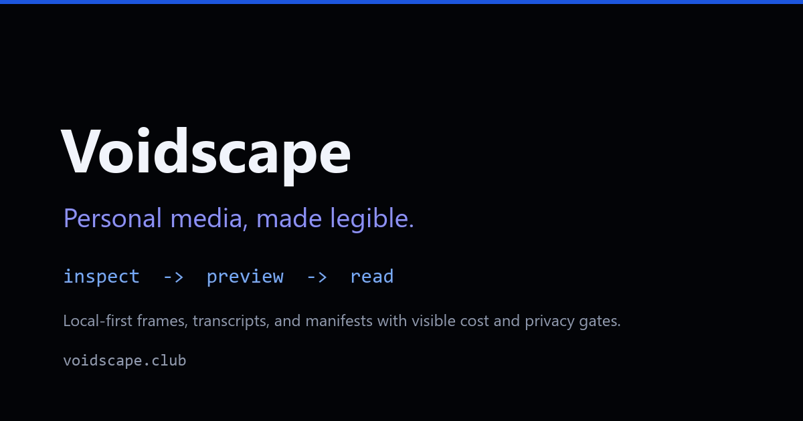
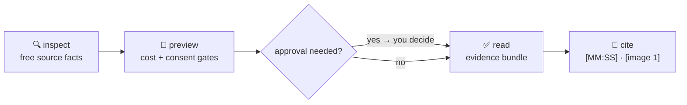

<div align="center">



# Voidscape

**Turn the media you keep into evidence an agent can cite — locally, visibly, and on your terms.**

[](LICENSE)
[](#requirements)
[](#requirements)
[](#-the-contract)
[](#requirements)

[Website](https://voidscape.club) ·
[Guide](https://voidscape.club/guide.html) ·
[Agent documentation](docs/agents/index.md) ·
[Issue Tracker](https://github.com/RikepilB/void-scape/issues)

</div>

---

Transcription is one channel — not the finished product. Give Voidscape a recording, a video URL,
a voice memo, one image, or a whole carousel folder, and it prepares **ordered visual evidence,
timestamped text, and a manifest your agent can actually inspect**. Before anything paid, remote,
or first-time-heavy happens, you see the cost and privacy gate and make the call.

No account. No API key. No uploads by default. Just your machine, your media, and receipts.

> 🎬 **Watch it work** — a 52-second terminal recording of the real flow:
> [`doctor` → `inspect` → `preview` → `read` on the key-free demo fixture](docs/assets/cli-demo.mp4)
> (recorded live, no account, no API key, no edits). Also embedded in the
> [guide](https://voidscape.club/guide.html).

## Why it exists

Agents are great at answering questions — and terrible at knowing what happened in a video they
cannot see. Title, thumbnail, and a guess are not evidence. Voidscape closes that gap:

- **Media becomes legible.** Frames, transcripts, and manifests instead of vibes.
- **Citations are built in.** Agents quote `[MM:SS]` moments and `[image 1]` positions, not hunches.
- **Consent is visible.** Cloud transcription and model downloads each need their own explicit,
  per-run approval. An API key in your environment is *not* consent.
- **Cost is a decision, not a surprise.** `preview` prices the work before `read` does it.

## How it works

Three deliberate moves. The order is the product.



| Step | Command | What you learn or get |
| --- | --- | --- |
| **Inspect** | `voidscape inspect <input>` | Duration, resolution, audio, captions, sidecars — free, changes nothing. |
| **Preview** | `voidscape preview <input>` | Transcription path, frame plan, token cost, dependency and approval state. |
| **Read** | `voidscape read <input>` | Only the approved artifacts: selected frames, transcript, and a manifest. |

It works the same for local video and audio, individual public video URLs, one image or a
filename-ordered carousel folder, articles, and RSS/Atom feeds. A matching `.srt`, `.vtt`, or
`.txt` file is reused as a free local sidecar instead of being generated again.

## Start here

You do not need to clone this repository. Install the CLI once, let it add the bundled agent skill,
then use `voidscape` from any terminal.

### 1 · Install `uv` once

**Windows PowerShell**

```powershell
winget install --id=astral-sh.uv -e
```

**macOS / Linux**

```bash
curl -LsSf https://astral.sh/uv/install.sh | sh
```

Already have `uv --version` working? Skip ahead. Voidscape also uses FFmpeg and FFprobe to inspect
media; `voidscape init` and `voidscape doctor` tell you whether they are ready, and if not:
`winget install --id=Gyan.FFmpeg -e` (Windows), `brew install ffmpeg` (macOS), or
`sudo apt update && sudo apt install ffmpeg` (Debian/Ubuntu).

### 2 · Install Voidscape and its agent skill

```powershell
uv tool install https://github.com/RikepilB/void-scape/archive/refs/heads/main.zip
uv tool update-shell
voidscape init
```

`uv tool install` creates the global `voidscape` command and installs `yt-dlp` in its isolated
environment. `voidscape init` copies the bundled skill to `~/.codex/skills/voidscape` and
`~/.agents/skills/voidscape`, checks local media tools, and does **not** approve a cloud job or a
model download. Command not visible yet? Open one new terminal and run `voidscape init` there.

CLI only? Use `voidscape init --no-skill`. Updating later: add `--upgrade` to the
`uv tool install` command, then run `voidscape init` again.

### 3 · Optional: choose where your media and notes live

```powershell
# Preview Inbox, Library, and local transcription defaults.
voidscape customize

# Save only after reviewing the preview.
voidscape customize --yes --create-dirs
```

`customize` stores local paths and defaults in `~/.voidscape/workspace.json`. It never stores API
keys, and model downloads plus every cloud transcription job remain separate approvals.

### 4 · Prove the flow

```powershell
voidscape doctor
voidscape inspect "meeting.mp4"
voidscape preview "meeting.mp4"
voidscape read "meeting.mp4" --workdir voidscape-output

# One local folder is one naturally ordered carousel.
voidscape inspect "slides"
voidscape preview "slides"
voidscape read "slides" --workdir slide-evidence
```

## What `read` hands back

```text
voidscape-output/
├── frames/           selected keyframes from the source timeline
├── transcript.txt    timestamped speech-to-text (when audio was approved)
└── manifest.json     the map: frames ↔ timestamps ↔ source facts
```

Hand that bundle to any agent with one prompt:

> Open `voidscape-output/manifest.json` and `transcript.txt`, then inspect `frames/`.
> Summarize the recording in three bullets. Support every factual claim with an exact `[MM:SS]`
> citation. If the evidence is insufficient, say so.

That last sentence is the product. An agent grounded in the manifest cites moments; an agent
guessing from a filename invents them.

Image reads prepare byte-preserving `images/` plus `manifest.json` — the folder is non-recursive,
follows natural filename order, and is capped at 100 images. Cite carousel evidence as
`[image 1]`, never as a fabricated timestamp.

## Use it with an agent

After install, use `/voidscape <file-or-url>` in an agent harness that exposes skills as slash
commands — or simply ask the agent to inspect, preview, and read your media with Voidscape. The
installed skill teaches it the same `inspect → preview → read` flow, and the agent should:

1. inspect the source;
2. preview the selected scope;
3. **stop for explicit consent** when cloud processing or a model download is required;
4. read the artifacts and answer with `[MM:SS]` or `[image 1]` citations.

Browser and phone control belong to the agent harness, not the media engine. With the approved
Chrome connection, Codex/ChatGPT or Claude can select permitted media in signed-in tabs, then run
Voidscape on the host that can access the files; ChatGPT Remote and Claude Code Remote Control can
continue that host task from a phone. Browser access does not authenticate `yt-dlp`.

Want the deep patterns — step-by-step collection runs, formatted deliverables
(Markdown/HTML/xlsx/docx/pdf), and grounded executive-scribe summaries? Read
[Workflow and protocol](docs/agents/workflow.md) and
[Agent automation](docs/agents/automation.md).

### Connectors and the harness kit

Voidscape stays a local evidence engine. Harness connectors — a messaging MCP the harness already
trusts, an approved browser tab, or the repository capture adapters — only deliver local files or
public URLs into the same `inspect → preview → read` gates; the
[connectors contract](docs/agents/connectors.md) keeps it that way (an MCP server itself remains
a documented no-go). Two pieces ship with that story:

- **Chat exports** — a WhatsApp-style `_chat.txt` reads natively as ordered `[message N]`
  evidence, fully local, referenced media included.
- **[Harness skill kit](docs/agents/harness-kit.md)** — copy-and-adapt templates (inbox triage,
  evidence-grounded outreach, learning capture, catch-up) that ride on Voidscape citations.

## Choose the right path

| You have… | You want… | Do this |
| --- | --- | --- |
| A recording, demo, meeting, or screen capture | Cited, timestamped evidence | `inspect → preview → read` |
| One image or a carousel folder | Ordered visual evidence, originals untouched | `inspect → preview → read` |
| A voice memo or call | A local transcript to reason from | `read ... --tier audio` |
| A supported public video URL | The useful part, kept locally | `inspect → preview → read` |
| A Substack article or RSS/Atom feed | Ordered text with source metadata | `inspect → preview → read` |
| Reddit, LinkedIn, X, TikTok, or another web source | To know what is possible first | `voidscape route <url>` |
| An agent, hook, or script driving it | Deterministic, machine-readable output | `voidscape ... --json` (below) |

Confirmed public Reel URLs can also be queued through a repository-only helper
(`scripts/instagram_capture_helper.py`) — it is not an installed command, and browser capture
remains a user-observed development workflow.

## Typical questions

<details>
<summary><b>Does Voidscape upload my media?</b></summary>

Not by default. Local files, sidecar subtitles, and local transcription stay on your machine. Any
cloud transcription path is blocked until you explicitly add `--allow-cloud`, and a first-time
local Whisper model download separately needs `--allow-model-download`.
</details>

<details>
<summary><b>What does it cost?</b></summary>

`preview` estimates transcription and API-equivalent agent-token cost before `read`, including the
dominant cost driver, backend chain, local dependency, and approval state. A Codex subscription
may not bill per API token; the GPT-5.6 amount is an honest comparison estimate.
</details>

<details>
<summary><b>What is the difference between <code>read</code> and <code>read-video</code>?</b></summary>

Voidscape is the guided name and product experience. `read-video` is the underlying, stable CLI and
legacy installed skill. Existing scripts keep using raw `video.py`; new users should start with
Voidscape.
</details>

<details>
<summary><b>Can I automate it?</b></summary>

The CLI is non-interactive when given explicit flags, so your scripts, hooks, and agent runners
can call it. Voidscape ships no scheduler or unattended worker — your automation remains
responsible for preserving the cloud and model-download approval gates.
</details>

<details>
<summary><b>What if a URL works in Chrome but not in the CLI?</b></summary>

Your browser may be signed in while the CLI is anonymous. Start with a public URL. For media your
account is permitted to access, export cookies for only that site, keep the file outside the repo,
and set `READ_VIDEO_YTDLP_COOKIES`. VPNs, expired sessions, platform extractor changes, and
missing Chrome site approval are separate common causes — see the
[authentication and troubleshooting guide](docs/authenticated-sources.md).
</details>

## Advanced engine interface

For scripts, subagents, and integrations, the raw engine remains stable:

```powershell
python skill/scripts/video.py manifest --compact
python skill/scripts/video.py probe "clip.mp4" --envelope --compact
python skill/scripts/video.py estimate "clip.mp4" --tier both --backend captions --envelope --compact
python skill/scripts/video.py run "clip.mp4" --tier both --backend captions --workdir out --envelope --compact

python skill/scripts/image.py manifest --compact
python skill/scripts/image.py probe "slides" --envelope --compact
python skill/scripts/image.py estimate "slides" --envelope --compact
python skill/scripts/image.py run "slides" --workdir slide-evidence --envelope --compact
```

The envelope is `{ok,data,error,meta}` with deterministic exit codes 0–6 and retryability
metadata. Run `voidscape sources --json` for the machine-readable platform matrix, and use
`--reader video|article|image` only when an ambiguous source needs an explicit override.

## Requirements

- Python 3.10+
- `ffmpeg` and `ffprobe` on `PATH`
- `yt-dlp` only for URLs
- `faster-whisper` only for local speech transcription

Run `voidscape doctor` to see what is ready — it changes nothing.

## The contract

- **Local-first.** Nothing leaves your machine without a per-run, explicit approval.
- **Readable boundary.** Cloud transfer and model downloads are separate, visible gates.
- **Citable output.** Every artifact maps back to the source timeline; agents quote moments, not
  vibes.
- **No hidden automation.** Installing Voidscape creates no scheduled job, no account permission,
  and no subscription-as-API-credit trap.
- **Reading, not acting.** Permission to read never implies following, messaging, or publishing.

## Documentation

| Document | What it covers |
| --- | --- |
| [Agent documentation](docs/agents/index.md) | The full agent-facing hub: install, quick start, concepts. |
| [Workflow and protocol](docs/agents/workflow.md) | Guided flow, raw protocol, collection runs, deliverables, summaries. |
| [Roadmap status](docs/agents/roadmap-status.md) | What is shipped, designed next, and exploring — with standing gates. |
| [Multi-harness, browser, and remote support](docs/harness-support.md) | Codex/ChatGPT, Claude, and phone-remote setups. |
| [Public and authenticated sources](docs/authenticated-sources.md) | Access layers, cookies, and troubleshooting. |
| [Advanced CLI reference](docs/cli-reference.md) | Every command and flag. |
| [Privacy and backend notes](skill/references/backends.md) | Transcription backends and their tradeoffs. |

## Built with Codex

Voidscape began from Richard Pillaca's existing `read-video` engine; the import is explicitly
separated in [Build Week provenance](docs/BUILD_WEEK_PROVENANCE.md). Richard chose the product
problem and boundaries: local-first processing, `inspect → preview → read`, separate approval for
cloud transfer and model downloads, source-timeline citations, and deferring unattended
orchestration.

Codex accelerated the repository migration and audit, exposed mismatches between claims and the
installed package, reproduced the scoped-timestamp defect, wrote regression tests and fixes, and
hardened the judge install path. GPT-5.6 is the target agent model for reading the resulting
frames and transcript; the preview reports its vision-token estimate before that evidence is
consumed.

## License

[MIT](LICENSE) © Richard Pillaca.
