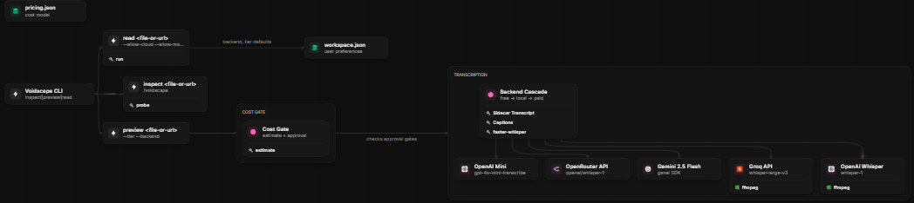

# Voidscape

[Website](https://voidscape.club) ·
[GitHub repository](https://github.com/RikepilB/void-scape)

**Turn media you keep into local, ordered evidence an agent can use.**

Transcription is one channel, not the finished product. Give Voidscape local images, a carousel
folder, a recording, or a supported video URL and it prepares ordered visual evidence, timestamped
text when relevant, and a manifest an agent can inspect. Before anything paid, remote, or
first-time-heavy happens, you see the cost and privacy gate.

Voidscape is the guided product layer for the open-source `read-video` engine. Its focus is the
decision and evidence boundary around an agent read: inspect the source, preview cost and consent,
then create only the approved artifacts. A matching `.srt`, `.vtt`, or `.txt` transcript can be
reused as a free local sidecar instead of being generated again.

`read-video` remains the stable engine and compatibility name for existing scripts and automations.

## Codebase Map

[](https://foglamp.dev/scan/voidscape-8fd1nx)

AI-generated map of the architecture (models, tools, integrations, flows) — **[view interactive on Foglamp →](https://foglamp.dev/scan/voidscape-8fd1nx)**

> Status: the installed bundle reads local images, filename-ordered carousels, videos, recordings,
> audio, and supported public video URLs. The repository contains an optional Instagram capture
> helper, but it is not installed as a Voidscape command. Substack/RSS intake, scheduling,
> universal capture, and hosting are not shipped.

## Start here

Run either installed command without arguments for a short Voidscape welcome screen and the next
command to try. The old `read-video` entry keeps its existing command behavior; its no-command
screen now points into the guided Voidscape flow.

### 1. Install both Voidscape and the read-video compatibility skill

**Windows PowerShell**

```powershell
.\scripts\install-skill.ps1
```

**macOS / Linux / Git Bash**

```bash
bash scripts/install-skill.sh
```

The installer creates the new `voidscape` skill and keeps `read-video` available for existing
automations. It never overwrites a local `workspace.json` or reads API keys.

### 2. Optional: choose where your media and notes live

Run this from the installed Voidscape skill, or use the repository path shown below:

```powershell
# Interactive: preview your settings, then confirm before saving.
python skill/scripts/voidscape.py customize

# Reuse an existing read-video workspace after reviewing the import.
python skill/scripts/voidscape.py customize --import-read-video --yes
```

`customize` stores only local folders and local defaults: Inbox, Library, transcription backend,
Whisper model, and the long-audio threshold. It never stores API keys. Use `--create-dirs` when you
want it to create missing Inbox or Library folders.

### 3. Inspect, preview, then read

```powershell
python skill/scripts/voidscape.py inspect "meeting.mp4"
python skill/scripts/voidscape.py preview "meeting.mp4"
python skill/scripts/voidscape.py read "meeting.mp4" --workdir out

# One local folder is one naturally ordered carousel.
python skill/scripts/voidscape.py inspect "slides"
python skill/scripts/voidscape.py preview "slides"
python skill/scripts/voidscape.py read "slides" --workdir slide-evidence
```

`inspect` is free source discovery. `preview` shows cost, dependencies, model-download state, and
whether audio would leave your machine. Video reads prepare `frames/`, `transcript.txt`, and
`manifest.json`; image reads prepare byte-preserving `images/` plus `manifest.json`. A carousel is
non-recursive, follows natural filename order, and is capped at 100 images. Cite video moments as
`[MM:SS]` and carousel evidence as `[image 1]`, never as fabricated timestamps.

Browser and phone control belong to the agent harness, not the media engine. With the approved
Chrome connection, Codex/ChatGPT or Claude can select permitted media in signed-in tabs, then run
Voidscape on the host that can access the files. ChatGPT Remote and Claude Code Remote Control can
continue that host task from a phone while the local tools remain on the host. Browser access does
not authenticate `yt-dlp`.

See [Multi-harness, browser, and remote support](docs/harness-support.md) and
[Public and authenticated sources](docs/authenticated-sources.md).

## Use it with an agent

After install, use `/voidscape <file-or-url>` in an agent harness that exposes skills as slash
commands, or simply ask the agent to inspect, preview, and read your media with Voidscape. The
agent should:

1. inspect the source;
2. preview the selected scope;
3. stop for explicit consent when cloud processing or a model download is required;
4. read the resulting artifacts and answer with `[MM:SS]` or `[image 1]` citations.

The installed skill teaches an agent the same `inspect → preview → read` flow. The concrete,
judge-testable interface is `python skill/scripts/voidscape.py ...`; repository-only agent files
under `.codex/agents/` are development helpers, not installed slash commands.

For a reproducible, key-free first run:

```powershell
python scripts/create-demo-fixture.py
python skill/scripts/voidscape.py inspect samples/build-week-demo.mp4
python skill/scripts/voidscape.py preview samples/build-week-demo.mp4 --tier both --backend captions
python skill/scripts/voidscape.py read samples/build-week-demo.mp4 --tier both --backend captions --workdir samples/build-week-output
```

Testing with other people? Use the short, privacy-aware
[community prototype protocol](docs/community-testing.md) and its local
`survey-cli` questionnaire to capture task completion, consent clarity, timestamp usefulness, and
the exact points where testers need help.

## Choose the right path

| Need | Use | What happens |
| --- | --- | --- |
| Understand a local recording, demo, meeting, or screen capture | `inspect → preview → read` | Frames, transcript, and manifest stay local by default. |
| Read one image or a local carousel folder | `inspect → preview → read` | The non-recursive folder is naturally ordered, limited to 100 images, and copied locally without changing originals. |
| Read a voice memo or call | `read ... --tier audio` | The CLI prepares a local transcript; an agent can then author a note from that evidence. |
| Prepare an Instagram Reel URL | Repository helper (not installed) | `scripts/instagram_capture_helper.py` validates and deduplicates confirmed URLs; browser capture remains a user-observed development workflow. |
| Work from a signed-in saved collection | Browser selection, then `inspect -> preview -> read` on one permitted media URL | The user signs in and approves browser access; private collection automation is not shipped. |
| Run from an agent, hook, or schedule | `voidscape.py ... --json` or raw `video.py ... --envelope --compact` | Non-interactive commands; Voidscape does not ship a scheduler. |
| Read a Substack series or RSS feed | Planned | Text/RSS ingestion is not part of the video engine yet. |

## Typical questions

### Does Voidscape upload my media?

Not by default. Local files, sidecar subtitles, and local transcription stay on your machine. Any
cloud transcription path is blocked until you explicitly add `--allow-cloud`. A first-time local
Whisper model download separately needs `--allow-model-download`.

### What does it cost?

`preview` estimates transcription and API-equivalent agent-token cost before `read`. The estimate
also explains the dominant cost, backend chain, local dependency, and approval state. A Codex
subscription may not bill per API token; the GPT-5.6 amount is an honest comparison estimate.

### What files are created?

For video/audio, `read` creates `frames/`, `transcript.txt`, and `manifest.json`. For images, it
creates ordered `images/` and `manifest.json`; the agent cites `[image 1]`. When a workspace is
configured, the agent workflow can save its final answer as a Markdown note in your Library; the
engine itself does not pretend to author the note.

### What is the difference between `read` and `read-video`?

Voidscape is the guided name and product experience. `read-video` is the underlying, stable CLI and
legacy installed skill. Existing scripts keep using raw `video.py`; new users should start with
Voidscape.

### Can I automate it?

The CLI is non-interactive when given explicit flags, so it can be called by your own scripts or
agent hooks. Voidscape does not ship a scheduler or unattended worker. Any automation remains
responsible for preserving the cloud and model-download approval gates.

### What if a URL works in Chrome but not in the CLI?

Your browser may be signed in while the CLI is anonymous. Start with a public URL. For media your
account is permitted to access, export cookies for only that site, keep the file outside the repo,
and set `READ_VIDEO_YTDLP_COOKIES`. VPNs, expired sessions, platform extractor changes, and missing
Chrome site approval are separate common causes. See the
[authentication and troubleshooting guide](docs/authenticated-sources.md) and the
[browser/CLI test matrix](docs/chrome-use-case-matrix.md).

## Advanced engine interface

For scripts, subagents, and integrations, the raw engine remains stable:

```powershell
python skill/scripts/video.py manifest --compact
python skill/scripts/video.py probe "clip.mp4" --envelope --compact
python skill/scripts/video.py estimate "clip.mp4" --tier both --backend captions --envelope --compact
python skill/scripts/video.py run "clip.mp4" --tier both --backend captions --workdir out --envelope --compact

python skill/scripts/image.py manifest --compact
python skill/scripts/image.py probe "slides" --envelope --compact
python skill/scripts/image.py estimate "slides" --envelope --compact
python skill/scripts/image.py run "slides" --workdir slide-evidence --envelope --compact
```

The envelope is `{ok,data,error,meta}` with deterministic error codes and retryability metadata.
See the [guided workflow and automation guide](docs/voidscape-guide.md),
[advanced CLI reference](docs/cli-reference.md), and [privacy/backend notes](skill/references/backends.md).

## Requirements

- Python 3.10+
- `ffmpeg` and `ffprobe` on `PATH`
- `yt-dlp` only for URLs
- `faster-whisper` only for local speech transcription

Run `python skill/scripts/voidscape.py doctor` to see what is ready without changing anything.

## Built with Codex

Voidscape began from Richard Pillaca's existing `read-video` engine; the import is explicitly
separated in [Build Week provenance](docs/BUILD_WEEK_PROVENANCE.md). Richard chose the product
problem and boundaries: local-first processing, `inspect → preview → read`, separate approval for
cloud transfer and model downloads, source-timeline citations, and deferring unattended
orchestration.

Codex accelerated the repository migration and audit, exposed mismatches between claims and the
installed package, reproduced the scoped-timestamp defect, wrote regression tests and fixes, and
hardened the judge install path. GPT-5.6 is the target agent model for reading the resulting frames
and transcript; the preview reports its vision-token estimate before that evidence is consumed.
The final submission should claim only work visible in dated post-import commits and the selected
Codex `/feedback` session.

See the [submission runbook](docs/build-week-submission.md) and
[project draft](docs/devpost-draft.md).

## License

[MIT](LICENSE) © Richard Pillaca.
