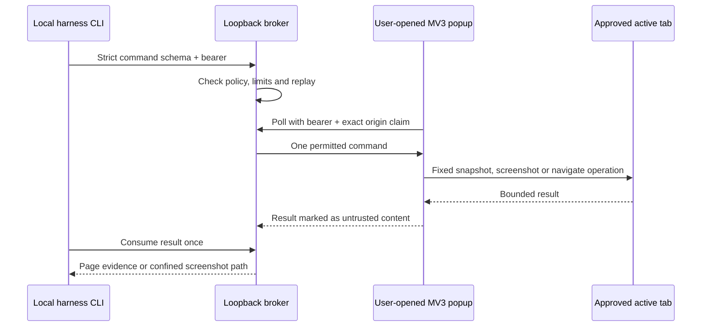

# Browser extension spike report

Status: **spike complete, dev-only**. This closes the investigation in #27, not the
production work in #58. It does not authorize installation or additional browser actions.

## Architecture and repository decision

Keep Agent Bridge in a separate repository. It owns browser transport and policy;
Voidscape remains a local media reader and receives only a permitted public URL or
local capture path. A future capture skill is a bridge client, never its host.
There is no bridge implementation bundled into the Voidscape skill.

The policy selects exact HTTPS origins, path rules, action names, navigation
destinations, and size/rate limits. The popup is the consent and lifetime boundary:
the user opens it and approves the active tab; session state stays in memory.
Closing it stops delivery. This is not a background browser agent.

The spike supports exactly `snapshot`, `screenshot`, and `navigate`. Its fixed
extension functions do not expose arbitrary JavaScript evaluation, cookie APIs,
browser storage, profile export, or credential retrieval.

## What was verified

The local evidence record dated **2026-09-06** documents one isolated Chrome 151
profile, an example.com-only policy, a fresh ephemeral broker session, and an
unpacked extension loaded through the browser's Developer mode. This is historical
QA evidence, not a fresh browser run on the report date.

| Test | Recorded result |
| --- | --- |
| Snapshot round-trip | Real page text returned with an untrusted-content label |
| Screenshot round-trip | Valid PNG written beneath the approved capture root |
| Same-origin navigation | Final URL matched the permitted destination |
| Result consumption | Second fetch rejected with `410 result_consumed` |
| Request replay | Duplicate request rejected with `409 replayed_request` |
| Disallowed origins/navigation | Rejected with `403` before extension execution |
| Popup closure | Queued work remained pending; no background delivery |
| Broker death | Popup disconnected and required explicit approval again |

The sibling's 38 unit tests also passed during the September 8 suite checkpoint.
They cover protocol/policy behavior; they do not establish universal harness support.

Source records reviewed for this report are the sibling repository's architecture,
September 6 decisions, `docs/qa/2026-09-06-real-chrome-e2e.md`, and rolling handoff.
The dated QA record supersedes the older architecture paragraph that still calls
real-Chrome transport unverified. This public summary intentionally omits account,
machine, extension-instance, token, and local profile identifiers. The underlying
private QA artifacts are not published by this report.

## Threat model and limits

| Boundary | Spike behavior | Remaining gap |
| --- | --- | --- |
| Untrusted websites | Exact origin policy, constrained verbs, bounded data | Browser DNS rebinding is not proven prevented |
| Local API requests | Loopback bearer, strict schemas, size/rate limits | A local process that obtains the bearer can impersonate a client |
| Extension identity | Exact origin claim; conflicting browser Origin rejected | The claim is self-asserted, not extension attestation |
| Replay and output | One-time results, duplicate request denial, confined screenshots | Restart invalidates the in-memory session; recovery is not proven |
| Evidence | Returned content is untrusted; audit holds action metadata | Visible pages can contain personal data; permitted capture still needs a narrow scope |
| Lifetime | User-opened popup, in-memory state, fail-closed disconnection | No unattended operation or persistent session claim |

The transport does not read browser-secret APIs. That does not mean page text or
screenshots are inherently non-sensitive: capture is restricted to the approved
tab and purpose, and must never be used to collect secrets visible on a page.

## What remains unverified

- OpenCode or another real harness integration; the CLI is only a protocol client.
- Signed-in or production profiles, sites beyond the test origin, and multiple tabs/windows.
- Pairing identity, production permission profiles, and independent security review.
- Source-specific mutations such as unsaving, sending, or publishing.
- Production installer/distribution and universal browser compatibility.

## Gate before production work

Issue #58 owns the next design: explicit extension-broker pairing, session-scoped
identity, per-client/per-site permission profiles, revocation, and audit boundaries.
That design must receive an independent security review before production code is
merged. Tests must include local impersonation, replay, pairing expiry/reuse,
revocation, origin changes, and capture confinement. A pairing code alone must not
be described as proof against a compromised local host.

Any additional action needs a narrow schema and explicit user authority. Each
harness/site/profile gets its own test evidence. Keep the three-verb spike unchanged
until that design and review exist; do not turn this report into permission to
install a plugin, broaden site access, export browser secrets, or send data elsewhere.
